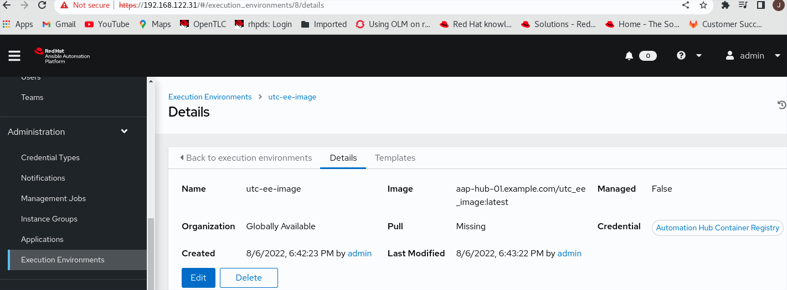
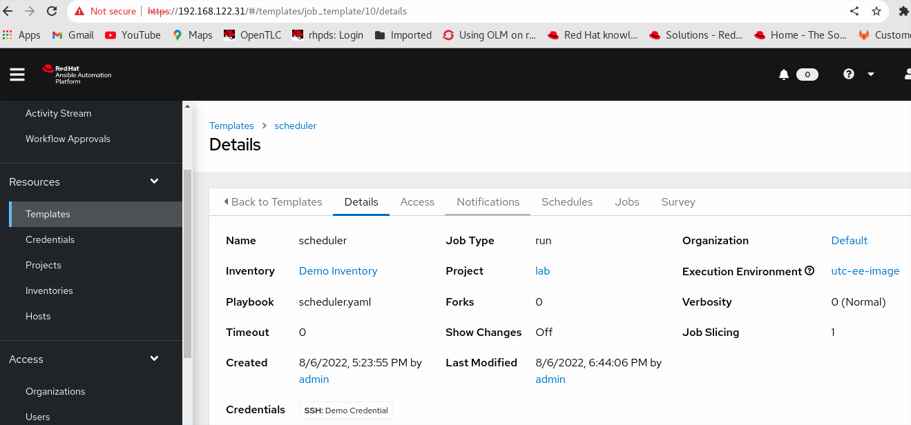
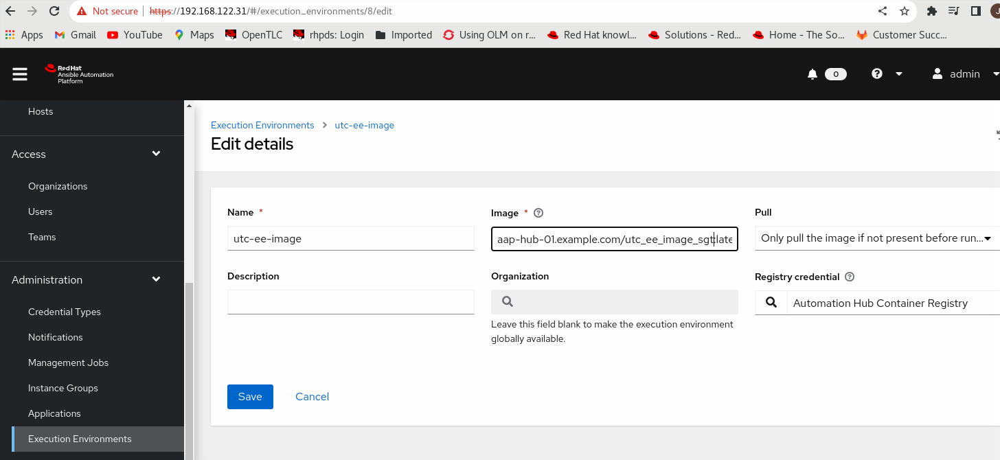
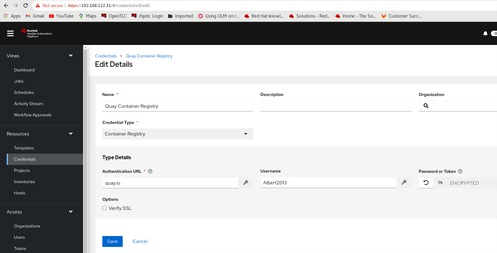
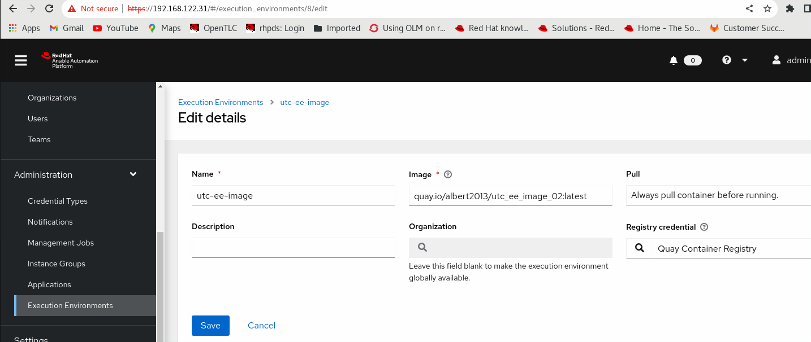

# AAP-Builder

```
echo "# AAP-Builder" >> README.md
git init
git add README.md
git commit -m "first commit"
git branch -M main
git remote add origin https://github.com/alpha-wolf-jin/AAP-Builder.git
git config --global credential.helper 'cache --timeout 7200'
git push -u origin main

git add . ; git commit -a -m "update README" ; git push -u origin main
```
# BackGroud

There is REST API needs SGT and UTC time as input.

The playbook works well when it runs on the local VM, but failed on execution container.

After troubleshooting, the root causes are found:
- missing rpm `tzdata` in the image
- the timezone in image is UTC instead of SGT as the VM 

This doc is about the troubleshoot & solution detection.


https://access.redhat.com/documentation/en-us/red_hat_ansible_automation_platform/2.1/html-single/ansible_builder_guide/index

https://docs.google.com/document/d/1qUO4o51tnp3RmrwAlfRE_Sm46L_ugtWynd1NotpiY2k/edit#heading=h.h46x7cgr87ug

# Create customized execute image

Add the tzdata rpm 

```
# pip3 install ansible-builder

# cat /etc/hosts
127.0.0.1   localhost localhost.localdomain localhost4 localhost4.localdomain4
::1         localhost localhost.localdomain localhost6 localhost6.localdomain6

192.168.122.31	aap-ctrl-01.example.com	aap-ctrl-01
192.168.122.32	aap-db-01.example.com	aap-db-01
192.168.122.33	aap-hub-01.example.com	aap-hub-01
192.168.122.34	aap-exec-01.example.com	aap-exec-01

[root@aap-ctrl-01 lab]# podman login -u=admin -p=redhat aap-hub-01.example.com --tls-verify=false
Login Succeeded!

# cat ansible.cfg 
# 

# cat bindep.txt 
tzdata [platform:rpm]

# cat execution-environment.yml 
version: 1


ansible_config: 'ansible.cfg' 

dependencies: 
  system: bindep.txt

# ansible-builder build -t utc_ee_image
Running command:
  podman build -f context/Containerfile -t utc_ee_image context


# podman images
REPOSITORY                                TAG         IMAGE ID      CREATED        SIZE
localhost/utc_ee_image                    latest      f5bb2d1bd3ab  5 minutes ago  994 MB

# podman tag f5bb2d1bd3ab aap-hub-01.example.com/utc_ee_image

# podman images
REPOSITORY                                TAG         IMAGE ID      CREATED         SIZE
localhost/utc_ee_image                    latest      f5bb2d1bd3ab  11 minutes ago  994 MB
aap-hub-01.example.com/utc_ee_image       latest      f5bb2d1bd3ab  11 minutes ago  994 MB

# podman push aap-hub-01.example.com/utc_ee_image:latest --tls-verify=false


```

### Click the resouce group `Execution Environment` under `Administration`

Configure the new execution image pointing to the newly create customized image in autohub



Configure the new execution for tempalte `scheduler`




# TroubleShooting

The time is not convert to UTC from SGT.

Login the execute iamge and found the local zone is UTC

```
# podman run -it --name test-01 --entrypoint /bin/bash  aap-hub-01.example.com/utc_ee_image:latest
bash-4.4# python3
Python 3.8.13 (default, Jun 24 2022, 15:27:57) 
[GCC 8.5.0 20210514 (Red Hat 8.5.0-13)] on linux
Type "help", "copyright", "credits" or "license" for more information.
>>> from datetime import datetime
>>> import pytz
>>> dt_str  = "20220806T185000"
>>> format  = "%Y%m%dT%H%M%S"
>>> local_dt = datetime.strptime(dt_str, format)
>>> print('Datetime in Local Time zone: ', local_dt)
Datetime in Local Time zone:  2022-08-06 18:50:00
>>> dt_utc = local_dt.astimezone(pytz.UTC)
>>> print('Datetime in UTC Time zone: ', dt_utc)
Datetime in UTC Time zone:  2022-08-06 18:50:00+00:00
>>> exit()
bash-4.4# date 
Sat Aug  6 11:39:13 UTC 2022
bash-4.4# 

>>> from dateutil.tz import gettz
Traceback (most recent call last):
  File "<stdin>", line 1, in <module>
ModuleNotFoundError: No module named 'dateutil'
>>> exit()


bash-4.4#  pip3 install python-dateutil
Collecting python-dateutil
  Downloading python_dateutil-2.8.2-py2.py3-none-any.whl (247 kB)
     ━━━━━━━━━━━━━━━━━━━━━━━━━━━━━━━━━━━━━━━━ 247.7/247.7 KB 8.8 MB/s eta 0:00:00
Requirement already satisfied: six>=1.5 in /usr/lib/python3.8/site-packages (from python-dateutil) (1.12.0)
Installing collected packages: python-dateutil
Successfully installed python-dateutil-2.8.2
WARNING: Running pip as the 'root' user can result in broken permissions and conflicting behaviour with the system package manager. It is recommended to use a virtual environment instead: https://pip.pypa.io/warnings/venv
WARNING: You are using pip version 22.0.4; however, version 22.2.2 is available.
You should consider upgrading via the '/usr/bin/python3 -m pip install --upgrade pip' command.
bash-4.4# 

bash-4.4# cp /usr/share/zoneinfo/Asia/Singapore /etc/localtime
bash-4.4# echo "Asia/Singapore" >  /etc/timezone

```


# Create new iamge and directly make changes inside 

```

# podman run -it --name test-01 --entrypoint /bin/bash  aap-hub-01.example.com/utc_ee_image:latest
bash-4.4# cp /usr/share/zoneinfo/Asia/Singapore /etc/localtime
bash-4.4# echo "Asia/Singapore" >  /etc/timezone
bash-4.4# date
Sat Aug  6 21:51:26 +08 2022
bash-4.4# exit
exit

# podman commit 9874093d9b4f aap-hub-01.example.com/utc_ee_image_sgt:latest

# podman images
REPOSITORY                                TAG         IMAGE ID      CREATED             SIZE
aap-hub-01.example.com/utc_ee_image_sgt   latest      5e8f4f307baa  About a minute ago  994 MB

```

# Verify TZ and Python TZ convert code in new image
```
# podman run -it --name test-03 --entrypoint /bin/bash  localhost/utc_ee_image_sgt:latest
bash-4.4# date
Sat Aug  6 20:51:14 +08 2022

bash-4.4# python3
Python 3.8.13 (default, Jun 24 2022, 15:27:57) 
[GCC 8.5.0 20210514 (Red Hat 8.5.0-13)] on linux
Type "help", "copyright", "credits" or "license" for more information.
>>> from datetime import datetime
>>> import pytz
>>> dt_str  = "20220806T145000"
>>> format = "%Y%m%dT%H%M%S"
>>> local_dt = datetime.strptime(dt_str, format)
>>> print(local_dt)
2022-08-06 14:50:00
>>> dt_utc = local_dt.astimezone(pytz.UTC)
>>> dt_utc = local_dt.astimezone(pytz.UTC)
>>> format = "%Y-%m-%dT%H:%M:%SZ"
>>> dt_utc_str = dt_utc.strftime(format)
>>> print(dt_utc_str)
2022-08-06T06:50:00Z
>>> exit()
```

# Upload to AutoHub
```
# podman images
REPOSITORY                                TAG         IMAGE ID      CREATED         SIZE
localhost/utc_ee_image_sgt                latest      6b3a2e33d792  14 minutes ago  994 MB

# podman tag  6b3a2e33d792 aap-hub-01.example.com/utc_ee_image_sgt:latest

# podman login -u admin -p redhat aap-hub-01.example.com --tls-verify=false

# podman push aap-hub-01.example.com/utc_ee_image_sgt:latest --tls-verify=false

```

Configure the new execution image pointing to the newly create customized image in autohub



# Direct Modify Image failed with below error
```
/usr/local/bin/ansible-playbook: ansible-playbook: line 22: syntax error near unexpected token `('
/usr/local/bin/ansible-playbook: ansible-playbook: line 22: `from __future__ import (absolute_import, division, print_function)'
```

# Solution 01

```
# cat execution-environment.yml 
version: 1


ansible_config: 'ansible.cfg' 

dependencies: 
  system: bindep.txt

additional_build_steps: 
  prepend: |
    RUN cp /usr/share/zoneinfo/Asia/Singapore /etc/localtime && echo "Asia/Singapore" >  /etc/timezone


# cat bindep.txt
tzdata [platform:rpm]

# > ./ansible.cfg
# cat ansible.cfg
#

# podman login registry.redhat.io

# ansible-builder build -t utc_ee_image_02
Running command:
  podman build -f context/Containerfile -t utc_ee_image_03 context
Complete! The build context can be found at: /root/builder/context

# cat /root/builder/context/Containerfile 
...
FROM $EE_BASE_IMAGE
USER root
RUN cp /usr/share/zoneinfo/Asia/Singapore /etc/localtime && echo "Asia/Singapore" >  /etc/timezone
COPY --from=builder /output/ /output/
RUN /output/install-from-bindep && rm -rf /output/wheels

# podman login -u="Albert2013" quay.io

# podman tag localhost/utc_ee_image_sgt:latest quay.io/albert2013/utc_ee_image_02:latest

# podman push quay.io/albert2013/utc_ee_image_02:latest

# podman images
REPOSITORY                           TAG         IMAGE ID      CREATED        SIZE
localhost/utc_ee_image_02            latest      3597adc6226c  6 minutes ago  994 MB
quay.io/albert2013/utc_ee_image_02   latest      3597adc6226c  6 minutes ago  994 MB

```


# Confirm TZ of iamge is Singapore 
```
# podman run -it --name test-03 --entrypoint /bin/bash  localhost/utc_ee_image_02:latest
bash-4.4# date
Sat Aug  6 22:52:19 +08 2022
bash-4.4# exit
exit
[root@aap-ctrl-01 lab]# podman images
REPOSITORY                                TAG         IMAGE ID      CREATED         SIZE
localhost/utc_ee_image_02                 latest      e475a8f5a193  57 seconds ago  994 MB
```

# Push AutoHub with err 500 
```
# podman login -u=admin -p=redhat aap-hub-01.example.com --tls-verify=false

# podman tag localhost/utc_ee_image_02:latest aap-hub-01.example.com/utc_ee_image_02:latest

# podman push aap-hub-01.example.com/utc_ee_image_02:latest  --tls-verify=false

Error: writing blob: uploading layer to https://aap-hub-01.example.com/v2/utc_ee_image_02/blobs/uploads/ac651413-e45b-4d20-8e4b-88d46c7ccf88?digest=sha256%3Af0a2109a2528cd1cf5eaa3f5867a6771e4a7c28ae7179d7cc67cbcc2b29f21fc: received unexpected HTTP status: 500 Internal Server Error

```

# Push to quay
```
# podman login -u="Albert2013" quay.io

# podman tag localhost/utc_ee_image_02 quay.io/albert2013/utc_ee_image_02

# podman push quay.io/albert2013/utc_ee_image_02:latest

```

### Click the resouce group `Execution Environment` under `Administration`

Configure the new Credentail for quay registry



Updated the new execution image setting




```
PLAY [localhost] ***************************************************************
TASK [debug] *******************************************************************
ok: [localhost] => {
    "msg": "Singapore Time: 2022-08-06T16:00:00"
}
TASK [pure python code] ********************************************************
changed: [localhost]
TASK [debug] *******************************************************************
ok: [localhost] => {
    "msg": "UTC Time: 2022-08-06T08:00:00Z"
}
```
